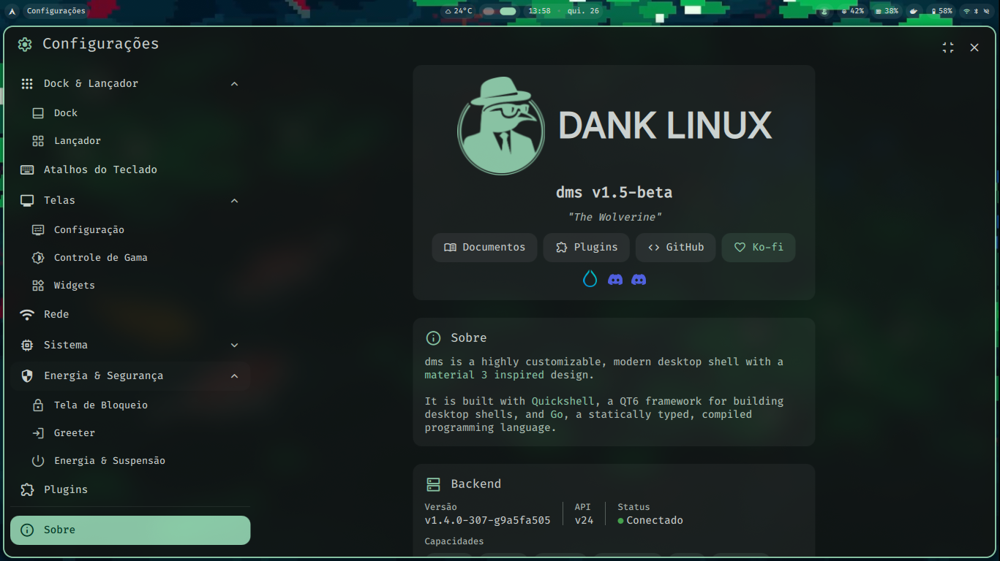
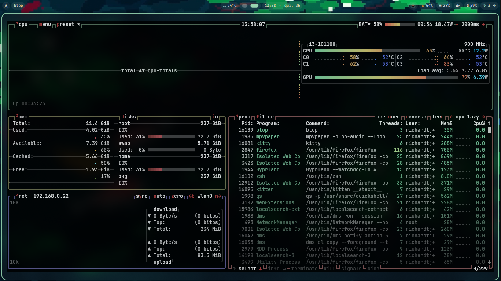
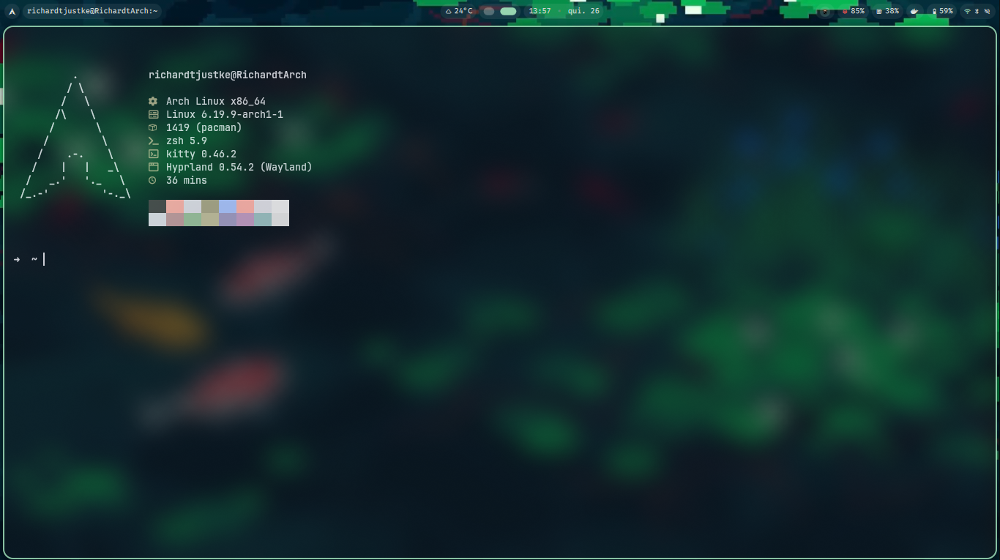

# 🎨 Dotfiles - Dank Material Shell (dms)

<div align="center">


Configurações personalizadas baseadas em [DankMaterialShell](https://github.com/AvengeMedia/DankMaterialShell)

**Wolverine** - Versão beta 1.5 com foco em performance e personalização extrema

</div>

---

## 📸 Screenshots

### Desktop Overview
![Dank Material Shell Interface]


### Terminal & Neovim
![Neovim & Terminal]


### System Monitor & Status
![System Stats]




---

## 📋 Índice

- [📸 Screenshots](#-screenshots)
- [Overview](#-overview)
- [Estrutura dos Dotfiles](#-estrutura-dos-dotfiles)
- [Configurações Principais](#-configurações-principais)
  - [Hyprland (WM)](#hyprlandwm)
  - [Neovim (Editor)](#neovim-editor)
  - [Kitty (Terminal)](#kitty-terminal)
  - [Zsh (Shell)](#zsh-shell)
- [DankMaterialShell Integration](#-dank-material-shell-integration)
- [Personalização](#-personalização)
- [Instalação](#-instalação)
- [Recursos & Links](#-recursos--links)

---

## 🎯 Overview

Este conjunto de dotfiles implementa um **environment de desenvolvimento moderno** baseado em:

| Componente | Propósito | Status |
|-----------|----------|--------|
| **DankMaterialShell** | Framework de design | ✅ Integrado |
| **Hyprland** | Tiling Window Manager | ⚡ Otimizado |
| **Neovim** | IDE/Editor | 🚀 LazyVim |
| **Kitty** | Terminal GPU-Accelerated | 🎨 Temas dinâmicos |
| **Zsh** | Shell moderno | 🐚 Oh-my-zsh |

### 🎨 Características Principais

```
┌─────────────────────────────────────────┐
│    ✨ Estética Minimalista               │
│    ⚡ Performance extrema                │
│    🔧 Customizável ao máximo            │
│    🎮 Workflow otimizado dev            │
│    🌈 Material Design 3 Integration     │
└─────────────────────────────────────────┘
```

---

## 📁 Estrutura dos Dotfiles

```
dotfiles/
│
├── 📂 fastfetch/              # 🖥️  System info display
│   ├── config.jsonc           # Config main
│   └── 📂 ascii/              # ASCII art themes
│       ├── arch.txt
│       └── rabbit.txt
│
├── 📂 hypr/                   # ⭐ Hyprland WM (Core)
│   ├── 🔧 hyprland.conf       # Config principal (main entry)
│   ├── 🔒 hyprlock.conf       # Lock screen
│   ├── 😴 hypridle.conf       # Idle behavior
│   ├── 🖥️  monitors.conf       # Monitores (nwg-displays)
│   ├── 📦 workspaces.conf     # Workspaces
│   ├── 🔄 hyprland.conf.backup.2026-03-19_22-49-12
│   └── 🆕 hyprland.conf.new   # Novo config (staging)
│   │
│   ├── 📂 custom/             # 🎯 Customizações pessoais
│   │   ├── env.conf           # Environment vars
│   │   ├── execs.conf         # Init commands (exec-once)
│   │   ├── general.conf       # General tweaks
│   │   ├── keybinds.conf      # ⌨️  Atalhos customizados
│   │   ├── rules.conf         # Window rules
│   │   └── 📂 scripts/        # Scripts bash
│   │       └── __restore_video_wallpaper.sh
│   │
│   ├── 📂 dms/                # 🎨 DankMaterialShell configs
│   │   ├── colors.conf        # Paleta (auto-gerado Matugen)
│   │   ├── binds.conf         # DMS keybinds
│   │   ├── cursor.conf        # Cursor settings
│   │   ├── layout.conf        # Layout/gaps/decorations
│   │   ├── outputs.conf       # Outputs físicos
│   │   └── windowrules.conf   # Window rules DMS
│   │
│   ├── 📂 hyprland/           # 🔵 Base Hyprland configs
│   │   ├── colors.conf        # Cores base
│   │   ├── env.conf           # Environment variables
│   │   ├── execs.conf         # Startup commands
│   │   ├── general.conf       # General settings
│   │   ├── keybinds.conf      # Keybindings base
│   │   ├── rules.conf         # Window rules
│   │   ├── 📂 scripts/        # Utilidade scripts
│   │   │   ├── fuzzel-emoji.sh          # Emoji picker
│   │   │   ├── launch_first_available.sh # Launcher
│   │   │   ├── snip_to_search.sh        # Snippet search
│   │   │   ├── start_geoclue_agent.sh   # Geo agent
│   │   │   ├── workspace_action.sh      # Workspace util
│   │   │   ├── zoom.sh                  # Cursor zoom
│   │   │   └── 📂 ai/                   # IA-assisted
│   │   │       ├── primary-buffer-query.sh
│   │   │       ├── show-loaded-ollama-models.sh
│   │   │       └── license_show-loaded-ollama-models.txt
│   │   │
│   │   └── 📂 shellOverrides/
│   │       └── main.conf      # Shell config overrides
│   │
│   └── 📂 hyprlock/           # 🔒 Lock screen theme
│       └── colors.conf        # Lock screen colors
│
├── 📂 kitty/                  # 🖥️  Terminal Emulator
│   ├── kitty.conf             # Config principal
│   ├── colors-matugen.conf    # Cores (geradas dinamicamente)
│   ├── custom.conf            # Custom overrides
│   ├── dank-tabs.conf         # Tabs styling (DMS)
│   ├── dank-theme.conf        # Theme (Material Design 3)
│   ├── kitty-cursor-trail.conf # Cursor trail effects
│   └── 🔄 kitty.conf.backup.2026-02-25_21-39-38
│
├── 📂 nvim/                   # ✏️  Neovim IDE (LazyVim)
│   ├── init.lua               # Entry point (require config.lazy)
│   ├── lazy-lock.json         # Plugin lock file
│   ├── lazyvim.json           # LazyVim config
│   ├── stylua.toml            # Lua formatter config
│   ├── LICENSE                 # Neovim license
│   │
│   ├── 📂 lua/
│   │   │
│   │   ├── 📂 config/         # ⚙️  Core configurations
│   │   │   ├── autocmds.lua   # Autocomandos
│   │   │   ├── keymaps.lua    # Keybindings
│   │   │   ├── lazy.lua       # Lazy.nvim bootstrap
│   │   │   ├── lsp.lua        # LSP setup
│   │   │   └── options.lua    # Editor options
│   │   │
│   │   ├── 📂 lualine/        # Statusline customização
│   │   │   └── 📂 themes/
│   │   │       └── dms.lua    # Tema DMS (Material Design 3)
│   │   │
│   │   └── 📂 plugins/        # 🔌 Plugin configurations
│   │       ├── avante.lua           # AI code assistant
│   │       ├── codecompanion.lua    # AI companion
│   │       ├── glance.lua           # Code preview
│   │       ├── mason.lua            # LSP/DAP manager
│   │       ├── neo-tree.lua         # File explorer
│   │       ├── remote-ssh.lua       # SSH remote dev
│   │       ├── rustacean.lua        # Rust tooling
│   │       ├── schema-store.lua     # JSON schemas
│   │       ├── themes.lua           # Theme manager
│   │       ├── toggleterm.lua       # Terminal integrado
│   │       ├── undotree.lua         # Undo history
│   │       └── vim-fugitive.lua     # Git integration
│   │
│   ├── 📂 colors/             # 🎨 Themes customizados
│   │   └── dms.lua            # Tema DMS (sincronizado)
│   │
│   └── 📂 .config/            # Symlink para ~/.config/nvim
│
├── 📂 zsh/                    # 🐚 Shell Zsh + Oh-my-Zsh
│   ├── .zshenv                # Environment setup
│   └── .zshrc                 # Main configuration
│
├── 📂 live/                   # 🎬 Wallpapers/Assets
│   └── (wallpapers here)
│
└── .gitignore                 # Git ignore patterns
```

---

## 🎨 Configurações Principais

---

### Fastfetch (System Info)

#### 🖥️ O que é?

**Fastfetch** é um display de informações do sistema ultra-rápido, escrito em C.

```bash
$ fastfetch
╭─ Arch Linux
├─ Linux kernel
├─ Hyprland (Wayland)
├─ 36 min uptime
└─ [Color palette]
```

#### 📁 Configuração

- **Config**: `fastfetch/config.jsonc`
- **ASCII Art**: `fastfetch/ascii/`
  - `arch.txt` - Arch Linux logo
  - `rabbit.txt` - Custom rabbit ASCII

**Exemplo config:**
```jsonc
{
  "logo": {
    "source": "~/.config/fastfetch/ascii/arch.txt",
    "padding": { "top": 2, "right": 3 }
  },
  "modules": [
    { "type": "title" },
    { "type": "os" },
    { "type": "kernel" }
  ]
}
```

---

### Hyprland (WM)

#### 🪟 O que é Hyprland?

```
╔════════════════════════════════════════╗
║  Hyprland - Modern Wayland Compositor  ║
╠════════════════════════════════════════╣
║  💨 Performance excepcional             ║
║  🎨 Animações suaves                    ║
║  ⌨️  Config via texto puro              ║
║  🖱️  Mouse + Keyboard full support     ║
║  📦 Modular & Extensível               ║
╚════════════════════════════════════════╝
```

#### 📐 Estrutura Modular

```
hyprland.conf (main entry)
       │
       ├─── monitors.conf          (Configuração de telas)
       ├─── workspaces.conf        (Espaços de trabalho)
       ├─── hypridle.conf          (Comportamento idle)
       ├─── hyprlock.conf          (Lock screen)
       │
       ├─── custom/                (Customizações pessoais)
       │    ├─ env.conf
       │    ├─ execs.conf
       │    ├─ general.conf
       │    ├─ keybinds.conf
       │    ├─ rules.conf
       │    └─ scripts/            (Utilitários bash)
       │
       ├─── dms/                   (DankMaterialShell presets)
       │    ├─ colors.conf         (Paleta Matugen)
       │    ├─ binds.conf
       │    ├─ cursor.conf
       │    ├─ layout.conf
       │    ├─ outputs.conf
       │    └─ windowrules.conf
       │
       └─── hyprland/              (Base Hyprland configs)
            ├─ general.conf        (Configuração modular)
            ├─ colors.conf
            ├─ env.conf
            ├─ execs.conf
            ├─ keybinds.conf
            ├─ rules.conf
            ├─ shellOverrides/     (Shell customization)
            └─ scripts/            (Scripts utilitários)
                └─ ai/             (Scripts com IA)
```

#### ⚙️ Configuração Principal

**hyprland.conf** (Entry point):
```hypr
monitor=,preferred,auto,auto
env = LIBVA_DRIVER_NAME,iHD
env = MOZ_ENABLE_WAYLAND,1

input {
    kb_layout = br
    numlock_by_default = true
}

general {
    gaps_in = 5
    gaps_out = 5
    border_size = 2
    layout = dwindle
}
```

**hyprland/general.conf** (Configuração modular avançada):
```hypr
general {
    gaps_in = 4
    gaps_out = 5
    gaps_workspaces = 50
    border_size = 1
    
    col.active_border = rgba(0DB7D455)
    col.inactive_border = rgba(31313600)
    resize_on_border = true
    allow_tearing = true
    
    snap {
        enabled = true
        window_gap = 4
        monitor_gap = 5
    }
}

# Gestures support (touchpad)
gesture = 3, swipe, move
gesture = 4, horizontal, workspace
gestures {
    workspace_swipe_distance = 700
    workspace_swipe_cancel_ratio = 0.2
}
```

#### 🎨 Paleta de Cores

Auto-gerada via **Matugen** e aplicada em `dms/colors.conf`:

```hypr
$primary  = rgb(97d4b0)  # Verde/Ciano principal
$outline  = rgb(8a938b)  # Outline das borders
$error    = rgb(ffb4ab)  # Erro/Aviso
```

**Aplicação automática:**
```hypr
general {
  col.active_border   = $primary
  col.inactive_border = $outline
}

group {
  col.border_active = $primary
  col.border_locked_active = $error
}
```

#### 🔧 Scripts Auxiliares

| Script | Função |
|--------|--------|
| `zoom.sh` | 🔍 Zoom do cursor (1.0-3.0x) |
| `fuzzel-emoji.sh` | 😀 Seletor de emojis |
| `launch_first_available.sh` | 🚀 Launcher com fallback |
| `workspace_action.sh` | 🏢 Ações de workspace |

**Uso:**
```bash
./zoom.sh reset    # Reset zoom
./zoom.sh 1.5      # Set zoom 1.5x
```

#### 🎬 Wallpaper Animado

```bash
mpvpaper -o "no-audio --loop" eDP-1 ~/Pictures/Wallpapers/live\ wallpapers/fish.mp4
```

---

### Neovim (Editor)

#### ✏️ Arquitetura

Baseado em **LazyVim** - distribuição moderna do Neovim:

```
Neovim + LazyVim
    │
    ├─ 🚀 Lazy Loading
    ├─ 📦 Plugin Manager
    ├─ 🎯 Sensible Defaults
    └─ ⚡ Performance First
```

#### 🔌 Plugins Principais

| Plugin | Função | Hotkey |
|--------|--------|--------|
| **Mason** | LSP/DAP manager | `:Mason` |
| **Neo-tree** | File explorer | `<leader>e` |
| **Avante** | AI code assistant | `:AvanteAsk` |
| **CodeCompanion** | AI coding | `:CodeCompanion` |
| **Toggleterm** | Terminal integrado | `<leader>tt` |
| **Undotree** | Undo history visual | `<leader>u` |
| **Fugitive** | Git integration | `:Git` |
| **Rustacean** | Rust tooling | Auto |
| **Remote-SSH** | SSH remote dev | `:RemoteSSH` |
| **Glance** | Code preview | `:Glance` |

#### 🎨 Tema Customizado

- **Color Scheme**: `lua/colors/dms.lua` (sincronizado com Hyprland)
- **Statusline**: `lua/lualine/themes/dms.lua` (Material Design 3)
- **Icons**: Nerd Fonts integradas

#### ⭐ Features

```
✅ LSP + Diagnostics
✅ Tree-Sitter syntax
✅ Git integration
✅ Terminal integrado
✅ Undo tree visual
✅ AI assist
✅ Remote development
✅ Full formatting
✅ Debug adapter
✅ Fuzzy finder
```

---

### Kitty (Terminal)

#### 🖥️ Configuração Base

```conf
# Fonte
font_family           JetBrainsMono Nerd Font
font_size             10

# Janela
initial_window_width  950
initial_window_height 500
remember_window_size  no

# Visual
background_opacity    0.6
cursor_blink_interval 0.5
enable_audio_bell     no
```

#### 🎨 Tema Dinâmico

```conf
include colors-matugen.conf          # Cores auto-geradas
include kitty-cursor-trail.conf      # Trail effect
include dank-theme.conf              # Material Design 3
include custom.conf                  # User overrides
```

#### ✨ Features Customizadas

- 🎭 **Dank Theme** - Material Design 3
- 📑 **Dank Tabs** - Custom tab styling
- 🎨 **Dynamic Colors** - Sincroniza com wallpaper
- 🎯 **Cursor Trail** - Traço visual do cursor
- 🚀 **GPU-Accelerated** - Renderização ultra rápida

---

### Zsh (Shell)

#### 🐚 Framework

```bash
ZSH_THEME="robbyrussell"
export ZSH="$HOME/.oh-my-zsh"
```

#### 📝 Arquivos

| Arquivo | Propósito |
|---------|-----------|
| `.zshrc` | Configuração principal |
| `.zshenv` | Environment setup |

---

## 🌈 DankMaterialShell Integration

### 🎨 O que é DMS?

```
DankMaterialShell (DMS)
├─ Material Design 3 (Google)
├─ Desktop Shell Framework
├─ Ultra-customizável
└─ Performance extrema (Go)
```

### 🔗 Como é Integrado

```
📐 DMS Palette (Matugen)
    │
    ├──→ Hyprland (WM) - Colors & Layout
    │
    ├──→ Kitty (Terminal) - Theme
    │
    └──→ Neovim (Editor) - Color Scheme
```

### 📂 Estrutura DMS

```
hypr/dms/
├── colors.conf          # 🎨 Paleta auto-gerada
├── binds.conf           # ⌨️  Keybinds DMS
├── cursor.conf          # 🖱️  Cursor settings
├── layout.conf          # 📐 Layout/gaps
├── outputs.conf         # 🖥️  Outputs físicos
└── windowrules.conf     # 📋 Window rules
```

### 🔄 Sincronização Total

```
Wallpaper (MP4/Image)
    ↓
Matugen gera paleta
    ↓
dms/colors.conf atualiza
    ↓
Hyprland recarrega
    ↓
Kitty sincroniza
    ↓
Neovim muda tema
    ↓
✨ Tudo harmonizado!
```

---

## 🔄 Personalização

### 🎨 Modificar Cores

1. **Editar paleta base:**
```bash
nano hypr/dms/colors.conf
```

2. **Modificar valores:**
```hypr
$primary  = rgb(97d4b0)  # Mude a cor
$outline  = rgb(8a938b)
$error    = rgb(ffb4ab)
```

3. **Aplicar:**
```bash
Super + R  # Reload Hyprland
```

### ⌨️ Adicionar Atalhos

```bash
# Editar
nano hypr/custom/keybinds.conf
```

**Formato:**
```hypr
bind = MOD+KEYS, action
bind = Super, Return, exec, kitty
bind = Super, D, exec, fuzzel
bind = Super+Shift, E, exit
```

### 📐 Modificar Layout

```bash
nano hypr/custom/general.conf
```

```hypr
gaps_in = 5       # Aumentar para mais espaço
gaps_out = 5
border_size = 2   # Aumentar border
```

### 🎬 Wallpaper Animado

```bash
nano hypr/hyprland/execs.conf
```

```bash
exec-once = mpvpaper -o "no-audio --loop" eDP-1 /path/to/wallpaper.mp4
```

---

## 📦 Instalação

### ✅ Pré-requisitos

```bash
# Essencial
Hyprland           # WM moderno
Zsh + Oh-My-Zsh   # Shell
Neovim (v0.9+)    # Editor
Kitty Terminal    # GPU-accelerated terminal
Git                # Version control

# Recomendado
Matugen            # Color generation
Fuzzel             # App launcher
Nerd Fonts         # Icons + symbols
```

### 🚀 Setup

```bash
# 1. Clone
git clone https://github.com/seu-user/dotfiles ~/dotfiles
cd ~/dotfiles

# 2. Backup antigos (se existir)
mkdir -p ~/dotfiles-backup
cp -r ~/.config/kitty ~/dotfiles-backup/ 2>/dev/null
cp -r ~/.config/nvim ~/dotfiles-backup/ 2>/dev/null
cp -r ~/.config/zsh ~/dotfiles-backup/ 2>/dev/null
cp -r ~/.config/hypr ~/dotfiles-backup/ 2>/dev/null
cp -r ~/.config/fastfetch ~/dotfiles-backup/ 2>/dev/null

# 3. Criar estrutura .config
mkdir -p ~/.config

# 4. Symlinks para ferramentas de usuário
ln -s ~/dotfiles/kitty ~/.config/kitty
ln -s ~/dotfiles/nvim ~/.config/nvim
ln -s ~/dotfiles/zsh ~/.config/zsh
ln -s ~/dotfiles/fastfetch ~/.config/fastfetch

# 5. Hyprland - Copiar com permissões (WM requer configs específicas)
mkdir -p ~/.config/hypr
cp -r ~/dotfiles/hypr/* ~/.config/hypr/
chmod +x ~/.config/hypr/*/scripts/*.sh
chmod +x ~/.config/hypr/*/*/scripts/*.sh 2>/dev/null

# 6. Recarregar Hyprland
# Super + Q (sair)
# Fazer login novamente
```

### 🔧 Pós-instalação

```bash
# Neovim - Instalar plugins
nvim +Lazy
# Press 'S' para sync plugins

# Zsh - Recarregar shell
exec zsh

# Hyprland - Recarregar config
Super + Shift + R  # Reload config dinamicamente

# Verificar instalação
nvim +checkhealth
fastfetch
```

---

## 🔗 Recursos & Links

### 📚 Documentação

| Projeto | Link |
|---------|------|
| **Hyprland** | [wiki.hypr.land](https://wiki.hypr.land) |
| **Neovim** | [neovim.io](https://neovim.io) |
| **Kitty** | [sw.kovidgoyal.net/kitty](https://sw.kovidgoyal.net/kitty) |
| **Zsh** | [ohmyz.sh](https://ohmyz.sh) |

### 🎯 Projetos da Comunidade

| Projeto | Descrição |
|---------|-----------|
| [DankMaterialShell](https://github.com/AvengeMedia/DankMaterialShell) | Base design |
| [LazyVim](https://www.lazyvim.org/) | Nvim distro |
| [Matugen](https://github.com/InioX/matugen) | Color generation |
| [Fuzzel](https://codeberg.org/dnkl/fuzzel) | App launcher |
| [Waybar](https://github.com/Alexays/Waybar) | Status bar |

---

## 💡 Tips & Tricks

### 🔍 Inspeção

```bash
# Monitores
hyprctl monitors

# Clientes (janelas abertas)
hyprctl clients

# Workspaces
hyprctl workspaces

# Keybinds
hyprctl binds
```

### 🔄 Reload/Debug

```bash
# Recarregar Hyprland
Super + Shift + R

# Debug mode
Hyprland -i :0 --debug

# Check Neovim
:checkhealth

# Kitty reload
Ctrl+Shift+F5
```

### 🎨 Color Schemes

```bash
# Gerar paleta de wallpaper
matugen image --quiet ~/Pictures/wallpaper.jpg

# Aplicar a ~/.config/colourscheme.toml
# Hyprland relê automaticamente
```

---

## 📊 Stats

```
┌─────────────────────────────────────┐
│ Componentes Configurados            │
├─────────────────────────────────────┤
│ Hyprland:      12 keybinds         │
│ Neovim:        12 plugins instalados│
│ Kitty:         6 configs            │
│ Zsh:           Customizado          │
└─────────────────────────────────────┘
```

---

## 📝 Changelog Recente

### ✨ Adições

- ✅ **Fastfetch** - Display de sistema ultra-rápido
- ✅ **Modularização Hyprland** - Configs separadas por função
- ✅ **Gestures Support** - Suporte a touchpad gestures (workspace swipe)
- ✅ **Snap Behavior** - Window snapping automático
- ✅ **Allow Tearing** - Tearing para melhor performance em jogos

### 🔄 Mudanças

- 📂 **Estrutura reorganizada** - Sem pasta `.config` intermediária
- 🎨 **Cores atualizadas** - Novo color scheme Matugen
- ⚙️ **General.conf modularizado** - Configs de Hyprland em `hypr/hyprland/general.conf`
- 🎬 **Wallpapers** - Suporte a mp4 animados

---

## 📝 Notas

### 🎬 Wallpapers

Armazenados em:
```
~/Pictures/Wallpapers/live\ wallpapers/
```

Configure o caminho em `hypr/hyprland/execs.conf`

### ⚡ Performance

- Hyprland + Wayland = Ultra rápido
- Desabilitar blur se necessário: `decoration { blur { enabled = false } }`
- Animations em `decoration { anim = ... }`

### 🔐 Security

```bash
# Proteger keys/secrets
echo "secrets/" >> .gitignore
```

---

## 🤝 Contribuindo

Sugestões e melhorias são bem-vindas!

```bash
# Fork → Branch → Commit → PR
git checkout -b feature/meu-recurso
git commit -am "Add: recurso incrível"
git push origin feature/meu-recurso
```

---

## 📄 Licença

Projeto pessoal. Veja licenças dos projetos incluídos:
- Hyprland - [MIT](https://github.com/hyprwm/Hyprland/blob/main/LICENSE.md)
- Neovim - [Vim](https://github.com/neovim/neovim/blob/master/LICENSE)
- Kitty - [GPL-3.0](https://github.com/kovidgoyal/kitty/blob/master/LICENSE)
- DankMaterialShell - [License](https://github.com/AvengeMedia/DankMaterialShell/blob/main/LICENSE)

---

<div align="center">

**Made with ❤️ using DankMaterialShell v1.5-beta on Hyprland**

🌟 Dê uma estrela se este projeto te ajudou!

_Last updated: 26 março 2026_

</div>
